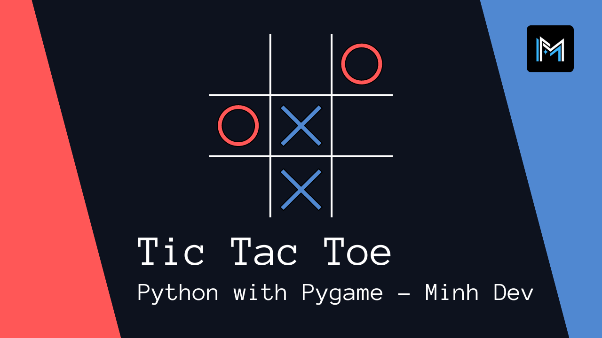

 
<h1 align="center">Sudoku</h1>

</img>

<h2>About</h2>

This is an assignment of my Y11 Software Design & Development. Our task is to create an educational software to teach someone who needs to learn something new as another learning tool. Learner could be of any age. WE can decide what the software will be; its content and use.

<h2>Goal and requirements</h2>

Our goal is to create the most comprehensive Sudoku game with the most user-friendly interface. This project will need to be implemented in Python with Pygame library. We will have 3 developers to work on this project and we need to divide the work equally through the team.

<h2>Key learnings</h2>

- We learn how to implement function and uses of Pygame library. 
- We also learn to document our process
- We learn how to make pseudocode and IPO chart
- We learn how to make gantt chart

<h2>Installation</h2>

1. Download the whole project as a zip file
2. Extract all the file
3. Run the main.exe file 
4. Enjoy the game!

<h2>Contributors</h2>

Author: 
- <a href="https://www.linkedin.com/in/minhvyha/" target="_blank">Minh Vy Ha</a>
- David Kouch
- DuyNguyen129
